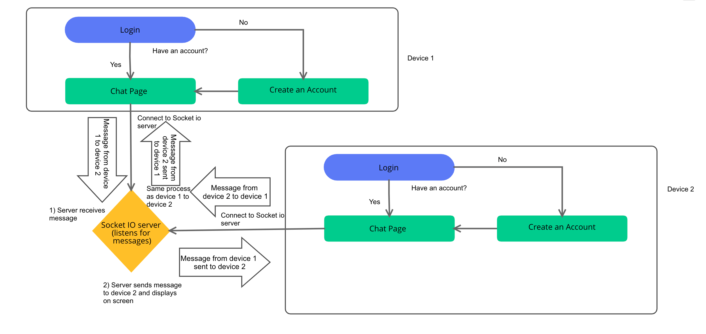
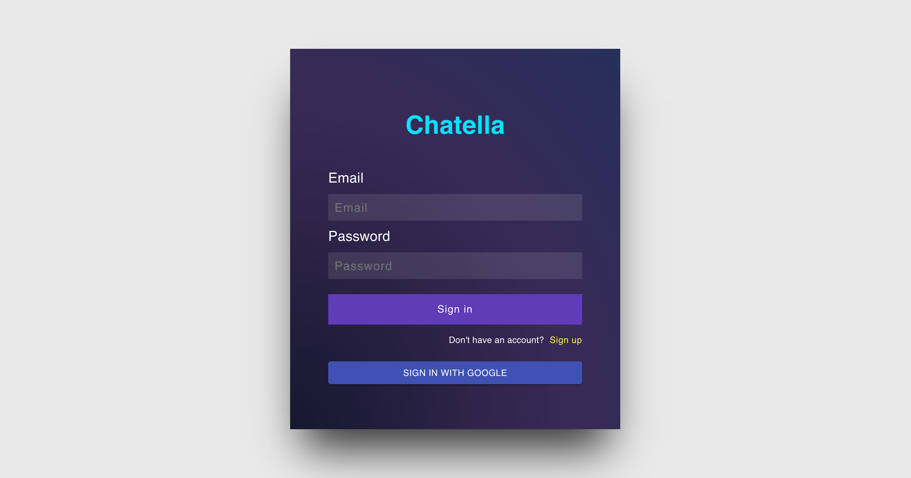
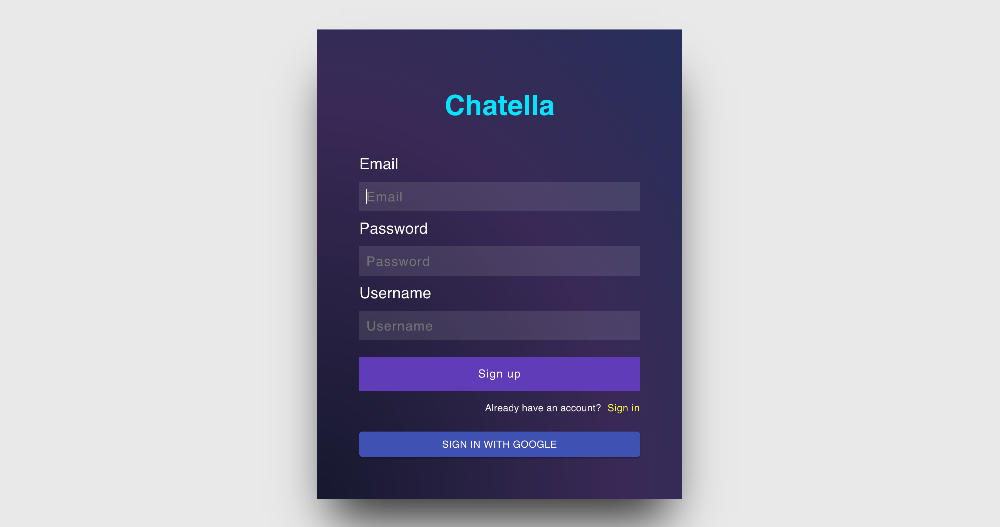
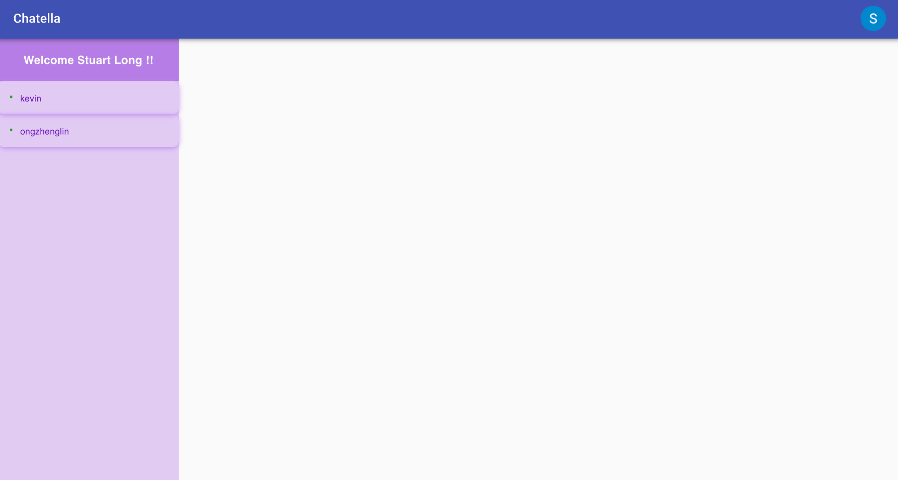
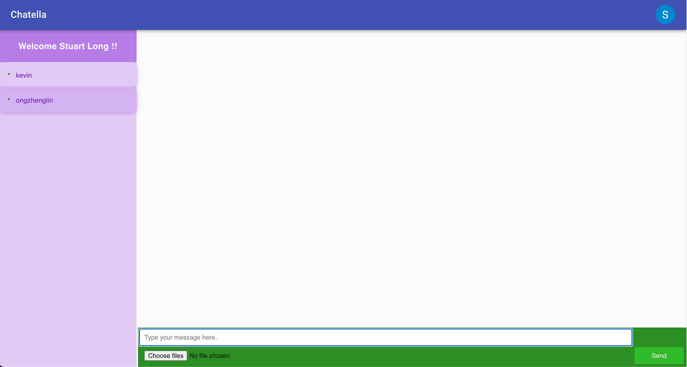
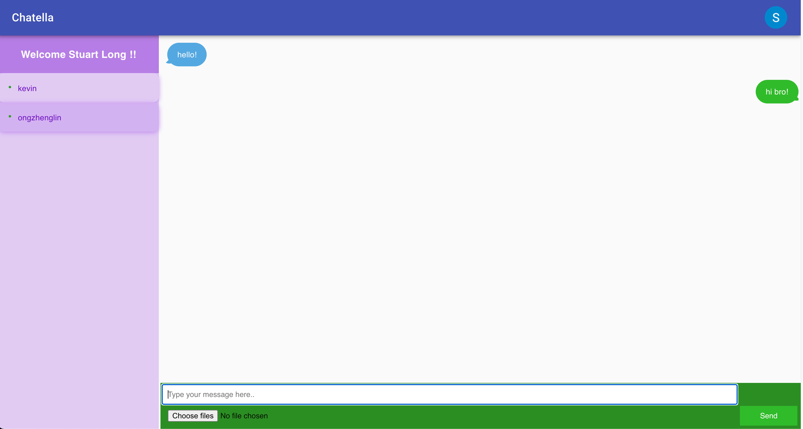

# Chatella

### **<u>Try it out:</u>** https://chatella.herokuapp.com/

### **<u>Proposed Level of Achievement:</u>** Apollo 11

A peer-to-peer(P2P) messaging app to chat with your online friends!

### **<u>Motivation</u>**

As Whatsapp was bought over by Facebook and changed their privacy policy,
it highlights the power these firms who own messaging platforms have over the content being sent over their platform, should the company
wish to, they could access these messages which would have to pass through their server and decrypt them
over time since they too provide the end-to-end encryption of users.

As whatsapp and telegram is getting too open and less private than before, we want to create a messaging
web application that provides secure, private and reliable service, yet working as efficiently as any other
messaging app. The web application keeps messages between people private from other parties or the
developer, yet carrying the functionality of a normal chat application.

So why not just remove the server in between the parties involved and make the entire system P2P, this would
avoid the leakage of information and increase the privacy of the chat, something that can be quite rare
nowadays.

### **<u>Aim</u>**

We hope to develop a P2P messaging web application, which ensures that communication on the web between
the parties involved is kept only between the parties involved.

### **<u>User Stories</u>**

1. As a student, I want privacy when sending and receiving my messages, so that I can feel more comfortable.
   I want to be able to message friends without the thought of people reading our messages.
2. As a young adult, I want my private messages to remain private, so that private information such as
   controversial political views or plans for legal/illegal activities (if any) remains private.

### **<u>Features and Timeline</u>**

#### **Implemented Features**
1. Implemented login page with login with google option
2. Peer-to-peer messaging app which does not store information of chats online
3. Log out button
4. Unique accounts for each user based on email
5. Ability to take photos and send to each other/ from gallery

#### **Features to be implemented in the future**
1. Ability to make voice/video calls (by mid July)
2. Password lock supported for any chats (by mid July)
3. GPS system to allow sharing of live locations (by end July)

### **<u>How are we different from similar platforms?</u>**

Our messaging app aims to follow the P2P framework where messages of users are not stored on a server but
on each device itself, improving privacy and security of the chats.

### **<u>Program Flow</u>**

### **<u>Tech Stack</u>**
ReactJS, ExpressJS, NodeJS, HTML, CSS, SocketIO, Firebase

### **<u>Developer guide</u>**
### ***<u>How to set up</u>***
1. Download this file into your computer. This is the client side file.
2. Download the socket io server from https://github.com/s7u4rt99/chatella_server
3. After editing the code, to run it on your machine, firstly, run "yarn start" in this folder to open up the react app. Then, go into the server code folder and run "yarn start" to start the socket io server.
4. Now, the react front end would connect to the socket io back and you can open new tabs and start chatting with them on your machine.

### ***<u>Testing</u>***
|S/N|Test             |Steps Taken   |Expected Output|Actual Output|Remarks|
|---|---------------------|-------|-----------|--------------|-------|
|1|Quality Assurance (Code Review)|Reviewed each other code after we debugged or added a new feature|Understand the added code|Understand the added code|NIL|
|2|Quality Assurance (Static Analysis)|Analysed code for unused methods or variables|Removed the unused variables / methods|Removed most unused variables / methods| Left some unused variables for debugging|
|3|Exploratory Testing|Tested sign up page with username|Opens the chat page after signing up and displays username at the top|Opens the chat page after signing up and displays username at the top|NIL|
|4|Exploratory Testing|Tested sign in page|Logs user in with username selected during sign up / google account name|Logs user in with username selected during sign up / google account name|NIL
|5|Exploratory Testing|Tested log out button|Logs user out and disconnects from backend|Logs user out and disconnects from backend|NIL|
|6|Exploratory Testing|Tested send message button|Sends message to other user|Sends message to other user|NIL|
|7|Exploratory Testing|Tested send file button to send photos|Ability to send photos on computer. Ability to send photos and take photos on phone|Ability to send photos on computer. Ability to send photos and take photos on phone|NIL|
|8|Exploratory Testing|Testing the toggle between chats|Displays messages with other user which user toggled to|Displays messages with other user which user toggled to|NIL|
|9|Unit Testing|Tested selectUserChatBox method|Opens chat with selected user and darkens the name in the online users column|Opens chat with selected user and darkens the name in the online users column|Could not integrate it with react at the start, but works fine now|
|10|Unit Testing|Tested notifyTyping method|Notifies user that the person who he/she is talking to is typing|Notifies user that the person who he/she is talking to is typing|NIL|
|11|Unit Testng|Tested loadChatBox method|Correctly loads the chat box with the user in the correct order|Correctly loads the chat box with the user in the correct order|Due to async programming, it had a bug and the photos were processed slower than normal messages, thus completing last and ending at the bottom. It is fixed now.|
|12|Integration Testing|Tested connection between react and socketIO server|Able to connect front end to server and chat with online users|Able to connect front end to server and chat with online users|Had an initial bug due to the version of socketIO which does not allow Cross-Origin Resource Sharing. Changed it to the correct version and it works.|
|13|Integration Testing|Tested ability to send messages/photos to other users through socketIO server|Messages/Photos get sent to the correct users|Messages/Photos get sent to the correct users|NIL|
|14|Integration Testing|Tested authentication by using firebase in react|User is able to create an account with correct username and login|User is able to create an account with correct username and login|NIL|
|15|System Testing (Performance Testing)|Tested with multiple users online|Users are able to chat with each other and toggle between chats|Users are able to chat with each other and toggle between chats|NIL|
|16|System Testing (Compatibility Testing)|Tested with different OS (Windows and mac)|Interface are similar and usable|Interface are similar and usable|Have not gotten interface to look good on mobile yet, but it still works|

### ***<u>Software Engineering Principles</u>***
**SOLID**

<U>S  -   SRP (Single Responsibility Principle)</U>

Every function in our client and server side each has their own unique purposes. They complement each other to complete complex tasks.

<u>O -   OCP (Open Closed Principle)</u>

Our code is open for extension and closed for modification.

<u>L  -   LSP (Liskov Substitution Principle)</u>

Every child class in our code are substitutable for their parent class.

<u>I   -   ISP (Interface Segregation Principle)</u>

Our interface for the client are flexible, and clients can choose which functions they would like to use.

<u>D -   DIP (Dependency Inversion Principle)</u>

Our code follows this principle, and our high level modules do not depend on low level modules.

**KISS**

Keep It Simple, Stupid

We strive to keep our code as simple as possible to ensure that it is readable, understandable and extendable.
We try out best not to complicate things in our code.

### ***<u>Prototype</u>***
<U>Sign in Page</U>

<U>Sign up Page</U>

<U>Chat Page (Without Chat Opened)</U>

<U>Chat Page (With Chat Opened)</U>

<U>Chat Page (With Chat Opened & Sending Messsages)</U>

      

### **<u>Project log</u>**

|S/N|Activity             |Date   |Stuart (hrs)|Zheng Lin (hrs)|Remarks|
|---|---------------------|-------|-----------|--------------|-------|
|1|Create Poster|12/5/21|1|1|Liftoff|
|2|Create Video|13/5/21|1|1|Liftoff|
|3|Setup for MC1|14/5/21|0.5|0.5|For Mission Control 1|
|4|MC1 (HTML/CSS/ReactJS)|15/5/21|2|4|Mission Control 1|
|5|Setup GIT   Watch GIT MC|16/5/21|2.5|2.5|MC1|
|6|React Native setup|19/5/21|2|1|MC1|
|7|Watch ReactN MC|20/5/21|2|2|MC1|
|8|Consult|21/5/21|0.3|0.3|Consult with advisor on how to start|
|9|Setup Github repo   Test Intellij git function|21/5/21|2|2|Setup|
|10|Reading on P2P systems|21/5/21|0|1|Research|
|11|Creating app from online sources|22/5/21|0.6|2|Creating simple chat web app   + p2p chat web app with help of online sources|
|12|Reading on SSH and tunneling(ZL)   NodesJS and its modules|23/5/21|1|2|Research|
|13|Watch ReactJS P1 MC|24/5/21|2.5|0|MC1|
|14|Testing tunnelling as POC   work on login page|24/5/21|0|2|Testing|
|15|Watch ReactJS P2 MC|25/5/21|2.5|2.5|MC2|
|16|Build app|25/5/21|5|5|Implementing login page & firebase|
|17|Reading on connecting back/front-end   & sockets|26/5/21|1|1|Research|
|18|Debugging and improving UI|26/5/21|3|3|Consult with advisor on bug problem|
|19|Debugging|27/5/21|6|3|Stuart: Combining SocketIo & React   ZL: Attempt to route between React and Node|
|20|Debugging|28/5/21|3|3|Stuart: Combining SocketIo & React   ZL: Attempt to route between React and Node|
|21|Debugging|29/5/21|3|4|Stuart: Combining SocketIo & React   ZL: Attempt integrate login page with chat-app|
|22|Deploy App   Debug   Combine back/front-end into one repo|30/5/21|8|7|Deploy on Vercel + Heroku   Solving bugs stopping deployment|
|23|Create Readme and video|31/5/21|4|4|Milestone 1 submission|
|24|Peer Evaluation|02/6/21|1.5|1.5|Read feedback and provide feedback for Milestone 1 submission|
|25|Debug trying to connect socket with React|02/6/21|2|2|Port app over to fully React|
|26|Debug trying to connect socket with React|07/6/21|4.5|2|Get Socket.io to work in React|
|27|Debug trying to connect socket with React   Consult|08/6/21|3|3|Get Socket.io to work in React|
|28|Debug trying to fix refresh/onclick bug|09/6/21|2|3|Get Socket.io to work in React|
|29|Debugging|10/6/21|1|2|Stuart: Fixed refresh bug   ZL: Trying to debug onclick by converting jquery into react|
|30|Added logout and Appshell|12/6/21|0|1|Added an appshell to chatpage with logout functionality|
|31|Debug and added login feature|13/6/21|3|3|Stuart: Added login with email and password feature   ZL:Debug appshell overlap & attempt to disconnect socket during logout |
|32|Debugging|14/6/21|3|3|Debugging multi-connection bug|
|33|Debug & consult|15/6/21|4.5|4|Stuart: Double-connection bug   ZL: Login and selectUserChatBox bug |
|34|Debug|16/6/21|2|2|Fixed double connection and still debugging selectUserChatBox bug|
|35|Debug|17/6/21|2|2|Try to debug selectUserChatBox bug|
|36|Debug|18/6/21|2|1|Try to debug selectUserChatBox bug|
|37|Fixed selectUserChatBox bug|19/6/21|0|2|Squashed selectUserChatBox bug|
|38|Fix interface|20/6/21|2|0|fix interface|
|39|Watch UI/UX workshop P1 |21/6/21|1.5|0|Setting up and watching part of UI/UX workshop part 1|
|40|Watch MC video|22/6/21|4.5|0|Watch UX & UI workshop|
|41|Add features|23/6/21|3|3|Stuart: sending photo feature   ZL: Save chat history feature by using localStorage(failed)|
|42|Debug/improve features|24/6/21|8|6|Stuart: Debug sending photo feature   ZL: Implementing feature of unique google accounts|
|43|Debug|25/6/21|4|5|Stuart: Fixed sign in page + CSS bug + hosting on heroku bug   ZL: Fixed unique account according to google id,   implemented multi window multi user chat that updates simultaneously |
|44|Hosting|26/6/21|4|2|Try to host backend and frontend on Heroku|
|45|Debugging + Updating documentation|27/6/21|5|4|Debugged Heroku and CSS bugs, update documentation|
|46|Updating ReadMe and filming video for MS2|3.5||Updating ReadMe and filming video for MS2||

|Total Hours|Stuart|Zheng Lin|
|-----------|------|---------|
|217.5|119|106|

### **<u>References/Sources</u>**
https://javabeginnerstutorial.com/javascript-2/chatbox-a-peer-to-peer-chat-application/

https://codepen.io/B99-AHMAD/pen/ExZeypj

https://www.callicoder.com/software-development-principles/
