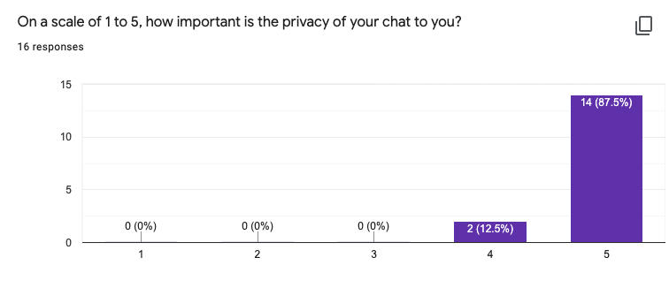
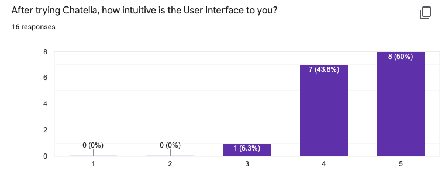
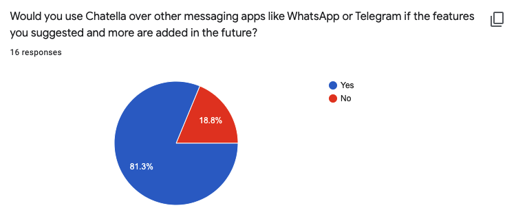

# Chatella

### **<u>Try it out:</u>** https://chatella.herokuapp.com/

### **<u>Proposed Level of Achievement:</u>** Apollo 11

A peer-to-peer(P2P) messaging app to chat with your online friends!

### **<u>Motivation</u>**

As Whatsapp was bought over by Facebook and changed their privacy policy,
it highlights the power these firms who own messaging platforms have over the content being sent over their platform, should the company
wish to, they could access these messages which would have to pass through their server and decrypt them
over time since they too provide the end-to-end encryption of users.

As whatsapp and telegram is getting too open and less private than before, we want to create a messaging
web application that provides secure, private and reliable service, yet working as efficiently as any other
messaging app. The web application keeps messages between people private from other parties or the
developer, yet carrying the functionality of a normal chat application.

So why not just remove the server in between the parties involved and make the entire system P2P, this would
avoid the leakage of information and increase the privacy of the chat, something that can be quite rare
nowadays.

### **<u>Aim</u>**

We hope to develop a P2P messaging web application, which ensures that communication on the web between
the parties involved is kept only between the parties involved.

### **<u>User Stories</u>**

1. As a student, I want privacy when sending and receiving my messages, so that I can feel more comfortable.
   I want to be able to message friends without the thought of people reading our messages.
2. As a young adult, I want my private messages to remain private, so that private information such as
   controversial political views or plans for legal/illegal activities (if any) remains private.

### **<u>Features and Timeline</u>**

#### **Implemented Features**
1. Implemented login page with login with google option.
2. Peer-to-peer messaging app which does not store information of chats online.
3. Log out button.
4. Unique accounts for each user based on email, messages will be updated across different devices with the same account.
5. Ability to take photos and send to each other/ from gallery.
6. Forget password option.
7. Email verification during sign-up to ensure no fake emails.

#### **Features to be implemented in the future**
1. Ability to make voice/video calls (Unable to complete)
2. Password lock supported for any chats (Unable to complete)
3. GPS system to allow sharing of live locations (Unable to complete)

### **<u>How are we different from similar platforms?</u>**

Our messaging app aims to follow the P2P framework where messages of users are not stored on a server but
on each device itself, improving privacy and security of the chats.

### **<u>Program Flow</u>**

### **<u>Tech Stack</u>**
ReactJS, ExpressJS, NodeJS, HTML, CSS, SocketIO, Firebase

## **<u>User guide</u>**

### ***<u>What is Chatella?</u>***
Chatella is a messaging web application, different from other messaging applications out there. 
The main difference between us and other messaging apps like Facebook and Telegram is that
we are using a system where our user's chats are not stored in a central database, unlike theirs.
This ensures that all our user's chats are private, and no one (not even us) would be able to read their messages. 
Chatella is one of the most (or the most) secure messaging apps out there!

### ***<u>Logging in</u>***
#### ***For first-time users:***
<U>Sign up Page</U>

1. If logging in with a Google account, click 'sign in with google' and follow the prompts to login.
2. If logging in with any other email, first sign up by entering Username, which will be the account's display name in the chat. Followed by the account's email and password which will be used in future logins.
3. A verification email will be sent to the email that was used to sign-up. Verify the account by following the steps in the verification email, check the spam/junk folder if the mail was not received.
4. Once verified, user will be redirected to the chat-page.

#### ***For returning users:***
<U>Sign in Page</U>

1. For users using Google login, user will be automatically logged in by Google if user did not log-out of the device previously. Otherwise, click 'sign in with google' and follow the prompts to login.
2. Once user has signed-up, click 'sign in' at the bottom with 'Already have an account? sign in' to be redirected to the login page.
3. Enter the email address and password that was used in the sign-up and click the login button.

### ***<u>Chatting</u>***
<U>Chat Page (With Chat Opened & Sending Messsages)</U>

1. The list of online users will be on the left-side of the screen which represents all online users on the server, click on the user's name of the person you would like to chat with(user box will be of a greyer shade).
2. User can send text messages or pictures which can be sent by clicking the 'Choose file' button below the text-box and hit send/enter.

### ***<u>Logging out</u>***
1. Click on the avatar icon on the top-right of the screen and select the 'logout' option in the drop-down menu.

## **<u>Developer guide</u>**
### ***<u>How to set up</u>***
1. Download this file into your computer. This is the client side file.
2. Download the socket io server from https://github.com/s7u4rt99/chatella-server
3. To run the app on your machine after editing the code, uncomment lines 36-41 and comment out line 42-47 from Chat.js. Next, run "yarn start" in this directory to open up the react app. 
   Subsequently, go into the directory which contains the server code and run "yarn start" to start the socket io server.
4. Now, the react front end would connect to the socket io back-end you can open new tabs and start chatting with them on your machine.

### ***<u>Directions:</u>***
Styling: src/components/style.css

Main Chat: src/pages/ChatPage.js

Login: src/pages/LoginPage.js & src/App.js

Overhead toolbar: src/components/header/AppShell.js

Online user container of the chat-page: src/components/OnlineUsers/OnlineUsers.js

Firebase configuration: src/components/config/firebase.js & src/index.js

Server: Follow step 2 of how to set up, our server code is found in that repository

### ***<u>Source Control</u>***
Github: https://github.com/s7u4rt99/chat-ella (react app) and https://github.com/s7u4rt99/chatella-server (node js server)

### ***<u>Testing</u>***
We conducted many testing methods on Chatella, such as Unit Testing, Integration Testing, System Testing, Regression Testing and User Testing. 
Throughout the development phase, we also conducted Quality Assurance Testing by using Github to review each other's code whenever there were changes to the code. 
We reviewed the code by explaining to each other what we changed/added during our weekly meetings on zoom. We felt this would be better than just looking 
at the commits each time there was a change to the code by ourselves, as we may miss out some information or misinterpret the logic. 

During the early development phase, we conducted some Exploratory Testing and Unit Testing. We tested each individual part of our app to check if they are functioning as expected.
We went about these tests by simply checking whether the actual output of the tests matched the desired output which we wanted to achieve. We tested these individual units extensively
by making sure the result was correct regardless whether the user used a correct input or not. These individual units form the foundation of our app, thus we wanted to make sure that
they work as expected in order for our app to be successful when we started integrating the different parts together.

After Exploratory and Unit Testing, we moved on to Integration Testing and System Testing. After ensuring that our different units work individually, we wanted to make sure that these
units work together as a whole. Hence, we integrated all our different parts together, such as by merging all the different components of front end/backend together, and finally combining the
front end and backend together. We ran some tests on the front end and backend, such as testing the connection of the user to our socket io server, the ability to send messages across to another user, as well
as authentication, to test if our app works seamlessly. This was a difficult process as there were many bugs during the integration, but through our sleepless nights and relentless dedication, we managed to integrate all of them together, 
allowing Chatella to work.

After we integrated Chatella, we added a few new features to the app. Whenever we added a new feature, we would conduct Unit Testing on it and Integration Testing after ensuring that it works
by itself. We also conducted Regression Testing whenever a new feature has been added such as email verification, forgot password feature and photo feature. We would test the features again whenever
a new feature has been added to ensure that the addition of the new feature did not introduce any bugs in our existing features.

We mainly employed manual testing instead of automatic testing as automatic testing for the general operation and UI would require too much work(tedious and time consuming)
and the time spent can be better used towards more manual testing, debugging and adding more features. Manual testing on the full-stack deployment would also allow us more opportunity to
identify any bugs that might show up after back and front end deployment.

Lastly, after the deployment of Chatella, we conducted User Testing on our users to get valuable feedback from them on how we can improve Chatella, especially on our UI/UX. 
We want to take the feedback and improve Chatella as much as possible before Splashdown. 

|S/N|Test             |Steps Taken   |Expected Output|Actual Output|Remarks|
|---|---------------------|-------|-----------|--------------|-------|
|1|Quality Assurance (Code Review)|Reviewed each other code after we debugged or added a new feature|Understand the added code|Understand the added code|NIL|
|2|Quality Assurance (Static Analysis)|Analysed code for unused methods or variables using Intellij's IDE|Removed the unused variables / methods|Removed most unused variables / methods| Left some unused variables for debugging|
|3|Exploratory Testing|Tested sign up page by signing up with email, password and username|Opens the chat page after signing up and displays username at the top|Opens the chat page after signing up and displays username at the top|NIL|
|4|Exploratory Testing|Tested sign up page by signing up with email, password and NO username|Prompts user to type in a username|Prompts user to type in a username|NIL|
|5|Exploratory Testing|Tested sign up page by signing up with password, username and bad email|Error message appears to inform user that the email was badly formatted|Error message appears to inform user that the email was badly formatted|NIL|
|6|Exploratory Testing|Tested sign up page by signing up with email and username but with password less than 6 characters|Error message appears to inform user that password has to be longer than 6 characters|Error message appears to inform user that password has to be longer than 6 characters|NIL|
|7|Exploratory Testing|Tested sign in page with correct email and password|Logs user in with username selected during sign up / google account name|Logs user in with username selected during sign up / google account name|NIL
|8|Exploratory Testing|Tested sign in page with wrong password|Informs user that the password is wrong|Informs user that the password is wrong|NIL
|9|Exploratory Testing|Tested sign in page with unregistered email|Informs user that the email does not have an account yet|Informs user that the email does not have an account yet|NIL
|10|Exploratory Testing|Tested log out button|Logs user out and disconnects from backend|Logs user out and disconnects from backend|NIL|
|11|Exploratory Testing|Tested send message button with non empty message|Sends message to other user|Sends message to other user|NIL|
|12|Exploratory Testing|Tested send message button with empty message|Does not send message to other user|Does not send message to other user|NIL|
|13|Exploratory Testing|Tested send file button to send photos|Ability to send photos and display on computer. Ability to send photos, take photos and display  on phone|Ability to send photos and display on computer. Ability to send photos, take photos and display  on phone|NIL|
|14|Exploratory Testing|Testing toggle between chats|Displays messages with other user which user toggled to|Displays messages with other user which user toggled to|NIL|
|15|Exploratory Testing|Tested email verification during signup|User receives an email by firebase to verify user's email|User receives an email by firebase to verify user's email|NIL|
|16|Exploratory Testing|Tested forget password method which sends link to change password|Email which user keys in receives a mail by firebase with a link to change the password|Email which user keys in receives a mail by firebase with a link to change the password|NIL|
|17|Unit Testing|Tested handleSignUp method with no missing fields|Creates an account on firebase with given email, password and username|Creates an account on firebase with given email, password and username|NIL|
|18|Unit Testing|Tested handleSignUp method with missing password|Does not create an account on firebase, and prompts user to key in missing detail|Does not creates an account on firebase, and prompts user to key in missing detail|NIL|
|19|Unit Testing|Tested handleSignUp method with missing email|Does not create an account on firebase, and prompts user to key in missing detail|Does not creates an account on firebase, and prompts user to key in missing detail|NIL|
|20|Unit Testing|Tested handleSignUp method with missing username|Does not create an account on firebase, and prompts user to key in missing detail|Does not creates an account on firebase, and prompts user to key in missing detail|NIL|
|21|Unit Testing|Tested handleLogin method with no missing fields|Logs in with given email and password|Logs in with given email and password|NIL|
|22|Unit Testing|Tested handleLogin method with missing/wrong password|Does not log in, and prompts user to key in missing detail|Does not log in, and prompts user to key in missing detail|NIL|
|23|Unit Testing|Tested handleLogin method with missing/wrong email|Does not log in, and prompts user to key in missing detail|Does not log in, and prompts user to key in missing detail|NIL|
|24|Unit Testing|Tested selectUserChatBox method|Opens chat with selected user and darkens the name in the online users column|Opens chat with selected user and darkens the name in the online users column|Could not integrate it with react at the start, but works fine now|
|25|Unit Testing|Tested notifyTyping method|Notifies user that the person who he/she is talking to is typing even when on multiple devices|Notifies user that the person who he/she is talking to is typing even when on multiple devices|NIL|
|26|Unit Testing|Tested chatNotificationCount method|Notifies user of the correct number of unread messages from other users. |Notifies user of the correct number of unread messages from other users. |NIL|
|27|Unit Testng|Tested loadChatBox method|Correctly loads the chat box with the user in the correct order|Correctly loads the chat box with the user in the correct order|Due to async programming, it had a bug and the photos were processed slower than normal messages, thus completing last and ending at the bottom. It is fixed now.|
|28|Unit Testng|Tested forgotPassword method|Sends email to given email to change password|Sends email to given email to change password|NIL|
|29|Integration Testing|Tested connection between react and socketIO server|Able to connect front end to server and chat with online users|Able to connect front end to server and chat with online users|Had an initial bug due to the version of socketIO which does not allow Cross-Origin Resource Sharing. Changed it to the correct version and it works.|
|30|Integration Testing|Tested ability to send messages/photos to other users through socketIO server|Messages/Photos get sent to the correct users|Messages/Photos get sent to the correct users|NIL|
|31|Integration Testing|Tested authentication by using firebase in react|User is able to create an account with username and login with the same email and password|User is able to create an account with username and login with the same email and passworf|NIL|
|32|Integration Testing|Tested authentication with email verification by using firebase in react|User is able to create an account with username, email and password and receives verification email. User can login with the same email and password after verification|User is able to create an account with username, email and password and receives verification email. User can login with the same email and password after verification|NIL|
|33|System Testing (Performance Testing)|Tested with multiple window single user|No change in number of users. |No change in number of users. |NIL|
|34|System Testing (Performance Testing)|Tested with multiple windows multiple user|Chat page across different windows of sender and receiver updated after new message. |Chat page across different windows of sender and receiver updated after new message. |NIL|
|35|System Testing (Performance Testing)|Tested with multiple users online|Users are able to chat with each other and toggle between chats|Users are able to chat with each other and toggle between chats|NIL|
|36|System Testing (Compatibility Testing)|Tested with different OS (Windows and mac)|Interface are similar and usable|Interface are similar and usable|Have not gotten interface to look good on mobile yet, but it still works|
|37|Regression Testing|Went through unit testing of all the methods again whenever new feature is added|All units working as supposed to|All units working as supposed to|NIL|

### ***<u>User Testing and Feedback</u>***
For user testing, we made a Google form and asked our friends to help us give their opinions, we got a total of 16 responses, the low response could be attributed to a bad timing (ie. back to phase 2 and the RV tragedy news)
which damaged their will to do anything, or the long load time for our app could have dissuaded them from completing the survey.

From our results, 87.5% of participants rated the privacy of their chat to be of highest importance(lv.5 out of 5), while only 12.5% rated it as of a high importance(lv.4 out of 5). No one rated it any lower.
We can see that privacy is a large area of concern for youngsters nowadays.

50% of participants rated our UI to be very intuitive(lv.5 out of 5), like they have been using it for decades, while 43.8% rated it to be quite intuitive(lv.4 out of 5) and only 6.3% rated it as having some difficulty using(lv.3 out of 5).
Overall, our UI is quite intuitive for new users to use and does not require much explanation to use.

Major suggestions to improve the UI include making it more mobile-friendly and to improve the look of the site.

Major features that were recommended for future success of the site are to include sending messages to offline users, ability to add friends and to form a friends list, see past messages and to be able to send stickers and other type of documents
81.3% of participants said they would use Chatella over other messaging apps like Whatsapp or Telegrams if the features they suggested and more were added in the future, those that would not use Chatella over other messaging app cited
the user count as a problem as a messaging app would require large scale adoption by the population to be attractive and feasible for use.

### ***<u>Software Engineering Principles</u>***
**SOLID**

<U>S  -   SRP (Single Responsibility Principle)</U>

Every function in our client and server side each has their own unique purposes. They complement each other to complete complex tasks.

<u>O -   OCP (Open Closed Principle)</u>

Our code is open for extension and closed for modification.

<u>L  -   LSP (Liskov Substitution Principle)</u>

Every child class in our code are substitutable for their parent class.

<u>I   -   ISP (Interface Segregation Principle)</u>

Our interface for the client are flexible, and clients can choose which functions they would like to use.

<u>D -   DIP (Dependency Inversion Principle)</u>

Our code follows this principle, and our high level modules do not depend on low level modules.

**KISS**

Keep It Simple, Stupid

We strive to keep our code as simple as possible to ensure that it is readable, understandable and extendable.
We try out best not to complicate things in our code.

[comment]: <> (### ***<u>Prototype</u>***)

[comment]: <> (<U>Sign in Page</U>)

[comment]: <> (![]&#40;./SignInPage.png&#41;)

[comment]: <> (<U>Sign up Page</U>)

[comment]: <> (![]&#40;./SignUpPage.png&#41;)

[comment]: <> (<U>Chat Page &#40;Without Chat Opened&#41;</U>)

[comment]: <> (![]&#40;./ChatPageWOChatOpened.png&#41;)

[comment]: <> (<U>Chat Page &#40;With Chat Opened&#41;</U>)

[comment]: <> (![]&#40;./ChatPageWithChatOpened.png&#41;)

[comment]: <> (<U>Chat Page &#40;With Chat Opened & Sending Messsages&#41;</U>)

[comment]: <> (![]&#40;./ChatPageWithMessages.png&#41;)

### **<u>Limitations</u>**
Video Call: Our original plan was to implement either the ability to send audio messages or place voice/video calls. However, we encountered problems while trying to implement them.
For sending audio message, we had to add in an MP3 recorder, as well as a MP3 player in the chatboxes. Recorders that we found were quite large on screen and would further clutter our UI.
For voice/video calls, the integration of using WebRTC and socket was an issue. Whenever we placed a video call, a new socket connection would be formed which caused many complications.
Additionally, the pressure of time also made the implementation and integration of these features difficult and we decided that time would be better spent on documentation and testing.

UI: The foundation of the app we used, designed the chat messages in a list format, and due to html and css structure its size is either fixed or grows with the size(length and breadth) of the list.
When trying to implement an option to hide the online-users container for better usability on devices with smaller screen(ie. phones), we ran into issues where the chat container could not stretch 
and fill the entire page, leaving a blank space of the hidden portion. Due to our implementation of the chat container and the lack of time, we decided to take out the hide online users option 
as it does not achieve much and would actually cause the user more work to hide/show when trying to change chat.

Local Storage of past chat messages: Our original approach was to use the Javascript built in function of localStorage, however during the construction of such a feature, we found out that the function was not able to save such
a large array and that localStorage was only able to maintain memory while the page was still open and so would not be portable across multiple devices and would not be permanently saved onto the local disk. We thought of saving the 
chat history on the server-side but then that would defeat the purpose of the app which would be that the server side would not keep any of the chat information. We also found that a web app cannot write directly to local disk and that
the only way to do was to make an app instead of a web-app. Due to the lack of time and the time needed to port over to an app form for our application, we decided to pushback this feature even though it is quite important.

GPS System: We feel that currently, there are other more important features which have not been implemented yet, such as voice and video calls, thus we decided to leave this out for now. 
Additionally, we felt that because our app is currently more suited for computers and not mobile devices yet, implementing the GPS system was not high on our priority list as our users would usually be 
at one spot and not moving around.

### **<u>Project log</u>**

|S/N|Activity             |Date   |Stuart (hrs)|Zheng Lin (hrs)|Remarks|
|---|---------------------|-------|-----------|--------------|-------|
|1|Create Poster|12/5/21|1|1|Liftoff|
|2|Create Video|13/5/21|1|1|Liftoff|
|3|Setup for MC1|14/5/21|0.5|0.5|For Mission Control 1|
|4|MC1 (HTML/CSS/ReactJS)|15/5/21|2|4|Mission Control 1|
|5|Setup GIT   Watch GIT MC|16/5/21|2.5|2.5|MC1|
|6|React Native setup|19/5/21|2|1|MC1|
|7|Watch ReactN MC|20/5/21|2|2|MC1|
|8|Consult|21/5/21|0.3|0.3|Consult with advisor on how to start|
|9|Setup Github repo   Test Intellij git function|21/5/21|2|2|Setup|
|10|Reading on P2P systems|21/5/21|0|1|Research|
|11|Creating app from online sources|22/5/21|0.6|2|Creating simple chat web app   + p2p chat web app with help of online sources|
|12|Reading on SSH and tunneling(ZL)   NodesJS and its modules|23/5/21|1|2|Research|
|13|Watch ReactJS P1 MC|24/5/21|2.5|0|MC1|
|14|Testing tunnelling as POC   work on login page|24/5/21|0|2|Testing|
|15|Watch ReactJS P2 MC|25/5/21|2.5|2.5|MC2|
|16|Build app|25/5/21|5|5|Implementing login page & firebase|
|17|Reading on connecting back/front-end   & sockets|26/5/21|1|1|Research|
|18|Debugging and improving UI|26/5/21|3|3|Consult with advisor on bug problem|
|19|Debugging|27/5/21|6|3|Stuart: Combining SocketIo & React   ZL: Attempt to route between React and Node|
|20|Debugging|28/5/21|3|3|Stuart: Combining SocketIo & React   ZL: Attempt to route between React and Node|
|21|Debugging|29/5/21|3|4|Stuart: Combining SocketIo & React   ZL: Attempt integrate login page with chat-app|
|22|Deploy App   Debug   Combine back/front-end into one repo|30/5/21|8|7|Deploy on Vercel + Heroku   Solving bugs stopping deployment|
|23|Create Readme and video|31/5/21|4|4|Milestone 1 submission|
|24|Peer Evaluation|02/6/21|1.5|1.5|Read feedback and provide feedback for Milestone 1 submission|
|25|Debug trying to connect socket with React|02/6/21|2|2|Port app over to fully React|
|26|Debug trying to connect socket with React|07/6/21|4.5|2|Get Socket.io to work in React|
|27|Debug trying to connect socket with React   Consult|08/6/21|3|3|Get Socket.io to work in React|
|28|Debug trying to fix refresh/onclick bug|09/6/21|2|3|Get Socket.io to work in React|
|29|Debugging|10/6/21|1|2|Stuart: Fixed refresh bug   ZL: Trying to debug onclick by converting jquery into react|
|30|Added logout and Appshell|12/6/21|0|1|Added an appshell to chatpage with logout functionality|
|31|Debug and added login feature|13/6/21|3|3|Stuart: Added login with email and password feature   ZL:Debug appshell overlap & attempt to disconnect socket during logout |
|32|Debugging|14/6/21|4|3|Debugging multi-connection bug|
|33|Debug & consult|15/6/21|4.5|4|Stuart: Double-connection bug   ZL: Login and selectUserChatBox bug |
|34|Debug|16/6/21|2|2|Fixed double connection and still debugging selectUserChatBox bug|
|35|Debug|17/6/21|2|2|Try to debug selectUserChatBox bug|
|36|Debug|18/6/21|2|1|Try to debug selectUserChatBox bug|
|37|Fixed selectUserChatBox bug|19/6/21|0|2|Squashed selectUserChatBox bug|
|38|Fix interface|20/6/21|2|0|fix interface|
|39|Watch UI/UX workshop P1 |21/6/21|1.5|0|Setting up and watching part of UI/UX workshop part 1|
|40|Watch MC video|22/6/21|4.5|0|Watch UX & UI workshop|
|41|Add features|23/6/21|3|3|Stuart: sending photo feature   ZL: Save chat history feature by using localStorage(failed)|
|42|Debug/improve features|24/6/21|8|6|Stuart: Debug sending photo feature   ZL: Implementing feature of unique google accounts|
|43|Debug|25/6/21|4|5|Stuart: Fixed sign in page + CSS bug + hosting on heroku bug   ZL: Fixed unique account according to google id,   implemented multi window multi user chat that updates simultaneously |
|44|Hosting|26/6/21|4|2|Try to host backend and frontend on Heroku|
|45|Debugging + Updating documentation|27/6/21|5|4|Debugged Heroku and CSS bugs, update documentation|
|46|Updating ReadMe and filming video for MS2|28/6/21|3.5|1.5|Updating ReadMe and filming video for MS2|
|47|Peer review|2/7/21|1|1|Do peer review|
|48|Peer review and improve UI|3/7/21|0|4|Try to improve the UI based on feedback given in peer review|
|49|Try to improve UI|4/7/21|0|1|Attempt to improve UI by editting CSS|
|50|Try to improve UI|5/7/21|0|1|Attempt to improve UI by editting CSS|
|51|Improve UI fixed undefined bug|7/7/21|2|0|Fixed bug that caused messages to show up as undefined and crash the server|
|52|Read about localstorage|9/7/21|0|1|Reading about saving chat data onto storage of device|
|53|Stuart: added feature.   ZL: update readme and read-up |10/7/21|4|3|Stuart: Added Email verification and forgot password feature   ZL: Update readme and read about sending audio|
|54|Added features and fix bugs|11/7/21|4|5|Stuart: Fixed forgot password bug & Added name bar above chat and researched about how to make video call   ZL: Testing email verification, implement browser notifications|
|55|Added features and research|12/7/21|1|0|Added video call icon into name bar and researched about how to make video call|
|56|Stuart: Fixed bug & research   ZL: Research|13/7/21|3|1|Stuart: Fixed bug which does not allow sending same photo twice in a row. Researched about pop up and added a video call pop up   ZL: Reading about hiding elements |
|57|Added features|15/7/21|0|5|Added hiding onlineUsers container option and try to optimize it|
|58|Working on video call feature|16/7/21|2|0|Building the video call feature|
|59|Building feature & watching MC|17/7/21|2|1|Stuart: Working on video call(no pop-up)   ZL: Watch software testing MC|
|60|Consult + watching MC|18/7/21|2|2|Consult about documentation and testing, watch MC about testing|
|61|Stuart: create google form and redeploy app   ZL: watching MC & update Readme|20/7/21|1|4|ZL: Watch web-security + software test MC & update readme|
|62|Added limitations to Readme|21/7/21|0|1|and some content to developers guide|
|63|Removed feature & bug fixes|22/7/21|1|0.5|removed 'hide onlineusers' feature. some bug fixes & redeployed|
|64|Updated Readme|23/7/21|3|1|worked on readme for MS3|
|65|Updated Readme & video recording|24/7/21|2|3|Updated time-log, testing and user testing & record video for MS3|
|66|Upload video and submit final MS3|25/7/21|0.5|0.5|Final changes to time-log and submission of MS3|

|Total Hours|Stuart|Zheng Lin|
|-----------|------|---------|
|291|148.5|142.5| 

### **<u>References/Sources</u>**
https://javabeginnerstutorial.com/javascript-2/chatbox-a-peer-to-peer-chat-application/

https://codepen.io/B99-AHMAD/pen/ExZeypj

https://www.callicoder.com/software-development-principles/
